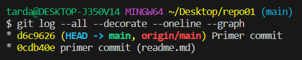

#### La otra otra parte de la documentación está aquí: [1.1 - 1.3](https://docs.google.com/document/d/1j715m4wy40CDnWMW1mSkL1gjkGmKwpmDfacgsDqzjW4/edit?usp=sharing "Documentación anterior")

># 1.4 - Intenta subir los ficheros al repositorio remoto mediante el comando git push ¿Se te ocurre qué está pasando? 
>>En un principio no podemos subir los ficheros a ningún repositorio remoto ya que no hemos vinculado ningúno. ❌

***

># 1.5 - Ejecuta el comando git remote -v e investiga porque no nos aparece nada.
>> Ejecutamos el comando **git remote -v**.
>>

***

># 1.6 - Crea un repositorio remoto llamado repo01, asócialo a tu repositorio local.
>>* Nos vamos a dirigir a **GitHub** y crearemos un nuevo repositorio.  
>>* 
>>* Ahora es hora de asociarlo a nuestro repositorio local usando las siguientes líneas:
>>*  
>>* Finalmente podremos ver que este archivo "readme.md" se encuentra en nuestro repositorio remoto.
>>* 

***

># 1.7 - Vuelve a ejecutar el comando git remote -v nuevamente y explica el porque ahora si que aparece.
>>Ejecutamos de nuevo el comando **git remote -v** y veremos que ya nos aparece nuestro repositorio en remoto.
>>
>>* Ahora nos aparece ya que hemos vinculado el repositorio local al remoto.

***

># 1.8 - Sube los cambios que hemos subido al snapshot local (commit) hacía al repositorio remoto.
>>* Primero vamos a añadir los archivos del repositorio local a la **stage area** usando un **git add readme.md** o si tenemos más de un archivo y los queremos subir todos un **git add .**.
>>* 
>>* Luego deberemos realizar un **git commit -m "(descripción)"**.
>>* 
>>* Por último debemos realizar un **git push -u origin main** para subir los cambios al repositorio remoto.
>>* Si volvemos a realizar un **git log** podremos ver que tanto el repositorio local como el remoto están en la misma versión.
>>* 

***

># 1.9 - Ves al repositorio remoto (en este caso GitHub) y comprueba que se haya realizado el commit correctamente y observa que pasa en el repositorio ¿Observas algo peculiar?
>>